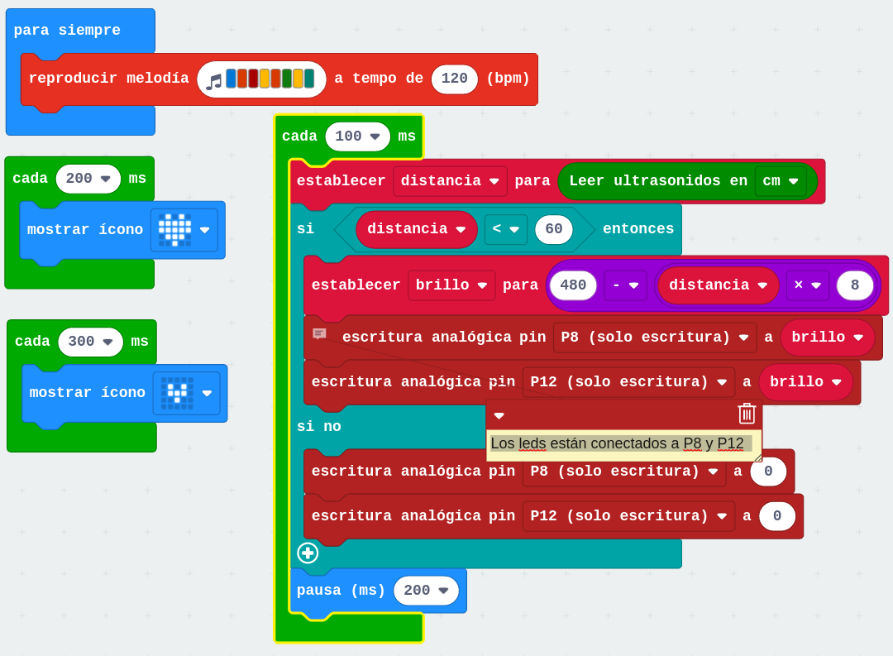

## Ejecutando varias tareas al mismo tiempo con micro:bit (multitarea)

Usamos el bloque de ejecución cada x segundos para hacer que las tareas se ejecuten cada cierto tiempo. 

Deben ser tareas ligeras y no debemos incluir esperas en ellas.

Podemos incluir tareas que se ejecuten cada 100 milisegundos o cada hora 3600000ms

[Proyecto - ejemplo de multitarea](https://makecode.microbit.org/_3A1MzEFKW989)

[Vídeo: Ejecutando varias tareas al mismo tiempo con micro:bit (multitarea)](https://youtu.be/S2S4lvQu3gk)
