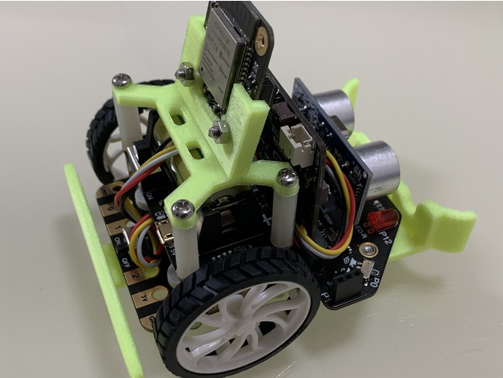
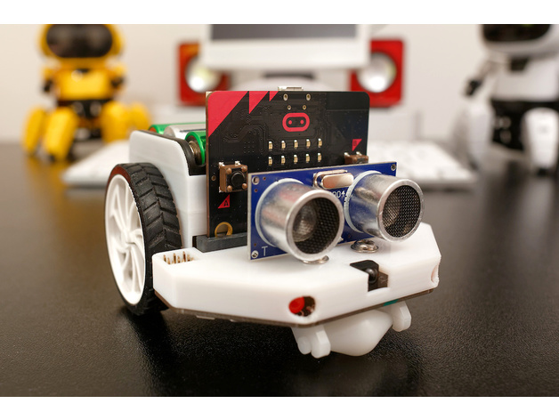
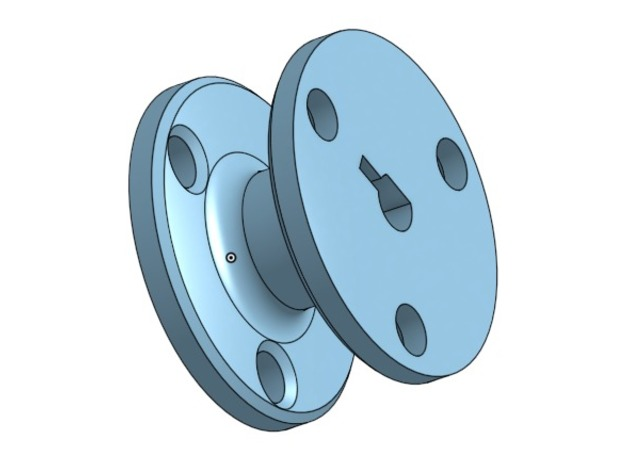
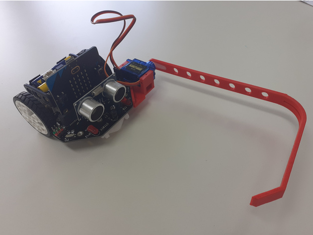
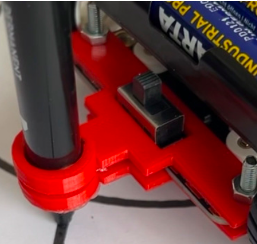
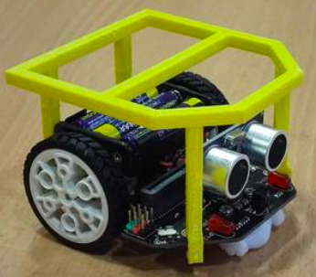
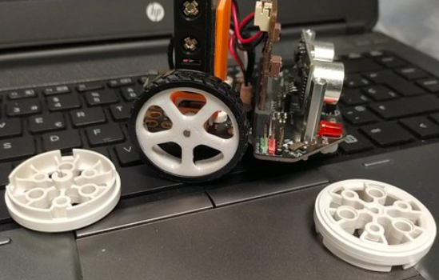

# Mejoras impresas en 3D

Si tenemos una impresora 3D podemos imprimir gran cantidad de complementos y mejoras

[Bumper+portapilas+soporte electrónica](https://www.thingiverse.com/thing:4706416)

[Estructura](https://www.thingiverse.com/thing:4228594)

Podemos utilizar esta [polea maqueen](https://www.thingiverse.com/thing:3443927) para hacer un ascensor o una grúa

[brazo-servo](https://www.thingiverse.com/thing:5260869)

[Soporte rotulador](https://www.thingiverse.com/thing:5328026)

[Porta cosas](https://www.thingiverse.com/thing:5257890)

[Ruedas maqueeen](https://www.thingiverse.com/thing:5367407)

## Mejoras para micro:bit

[power cable clip](https://www.thingiverse.com/thing:3403223)

