# Robot MaQueen

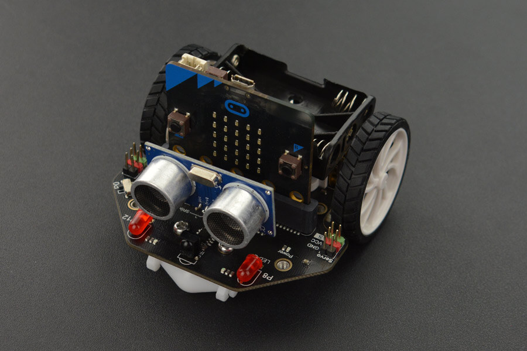

[Documentación dfrobot](https://wiki.dfrobot.com/micro_Maqueen_for_micro_bit_SKU_ROB0148-EN)

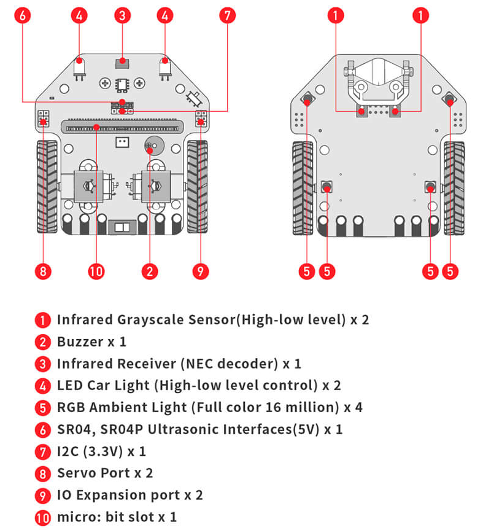

### Programación con bloques

Para poder programarlo desde Makecode con bloques tenemos que añadir su extensión, para lo que pondremos en el buscador de extensiones la siguiente URL https://github.com/DFRobot/pxt-maqueen

### Ejemplos

#### Movimientos sencillos y led delanteros

Vamos hacer un ejemplo sencillo de movimiento a la vez que encedemos y apagamos los led rojos delanteros

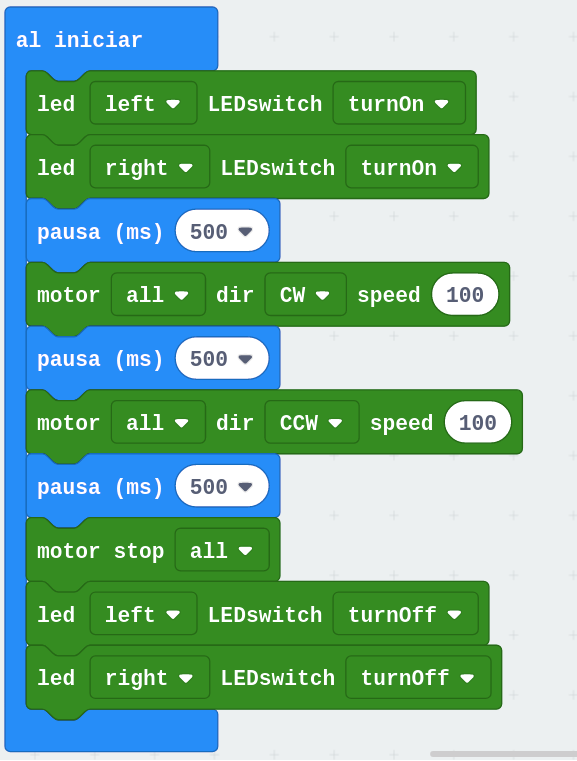

[Proyecto](https://makecode.microbit.org/_ixqfbfA2HAxu)

#### Girando N grados o moviéndonos X cm

Para poder controlar con cierta precisión (hay que recordar que los motores del robot son motores DC y que no está pensado para hacer movimientos precisos) vamos a empezar midiendo el tiempo necesario para conseguir hacer esos movimientos. Esto es un proceso de calibración de los movimiento que podíamos hacer una forma más serie y científica midiendo distancias con la regla y ángulos

Empezaremos viendo el tiempo que necesitamos para hacer un giro de 180º.
Luego veremos el tiempo necesario para recorrer.

Para facilitar el proceso hemos creado dos funciones. Una función es una manera de crear nuestro propios bloques que funciona como un "atajo" para reutilizar varias veces un grupo de bloques datos. Para ello pulsamos en "Crear función" (en la paleta de funciones) y definimos los bloques que la compondrán. Cada vez que queramos utilizarla arrastraremos el bloque que hemos creado

Para hacer movimientos más complejos nos va a venir muy bien, puesto que podremos descomponerlos en movimientos más sencillos que se repetirán.

[Proyecto](https://makecode.microbit.org/_95LdTUac6UY5)

#### Recorriendo un cuadrado

Ya que le hemos pillado el truco a la calibración de distancias y giros vamos a hacer que maqueen recorra un cuadrado. Para ello crearemos una nueva función "Giro 90"

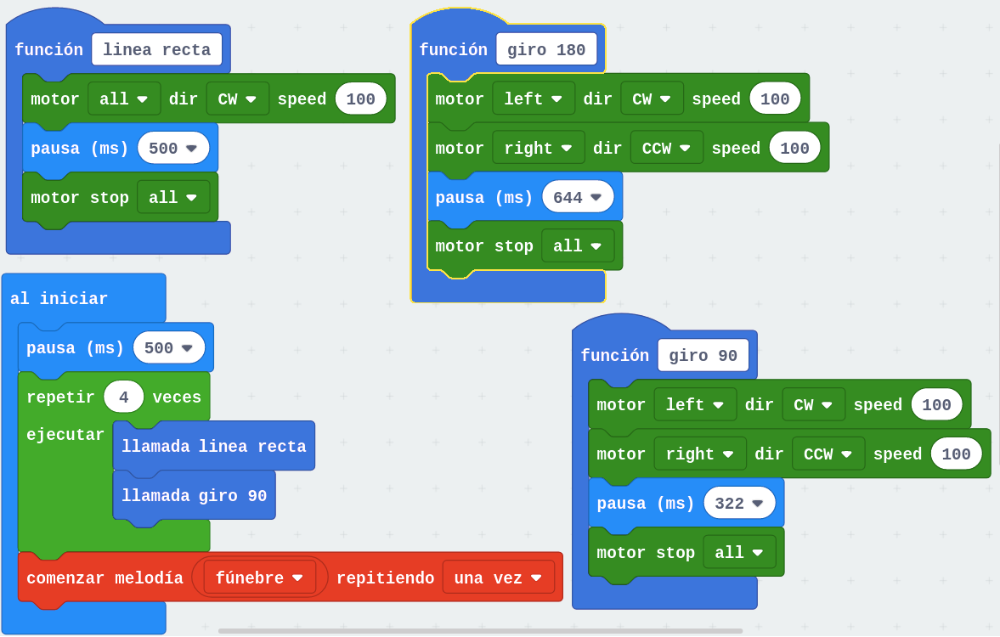

[Proyecto](https://makecode.microbit.org/_hCYV6Jga1gJE)

### Pirutas  y ¡Stop!

Vamos a hacer ahora que nuestro maqueen haga algunas sencillas piruetas y que lo podamos parar de varias formas: por tiempo, al tocar el logo o al dar una palmada

Antes de usarlo tenemos que calibrar el nivel de sonido y ajustarlo al principio

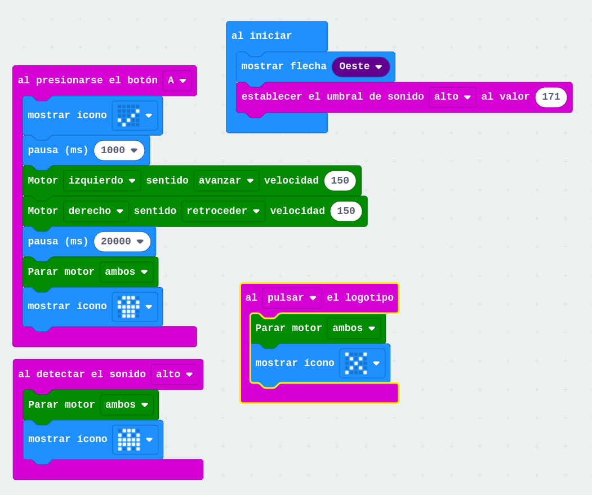

#### 4 x Leds RGB

Antes de programar las leds RGB añadimos la extensión de NeoPixels

[Ejemplo sencillo](https://makecode.microbit.org/_FXpHRk6m28pb)
Seleccionamos el P15 que es al que están conectados los 4 neopixels

#### Movimiento + leds colores + sonido = coche de policía

Vamos a combinarlo todo añadiendo algo de sonido

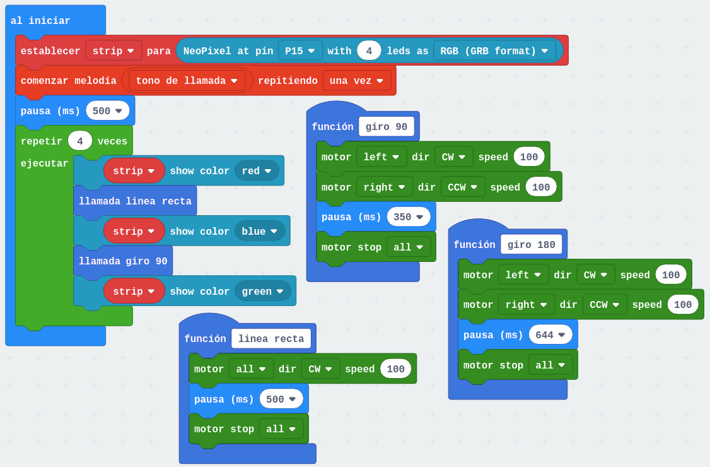

[Proyecto](https://makecode.microbit.org/_D66U4o6Mm83D)

#### Detectando líneas

Vamos a utilizar los sensores de infrarrojos que tiene maqueen en la parte de abajo para detectar lineas negsa sobre fondo blanco.

En primer lugar tenemos que estar seguros de que las detecta bien, para ello vamos a hacer un programa de calibración (en robot más profesionales podemos calibrar el umbral de detección, pero maqueen no lo tiene)

Hemos puesto detección de los 4 casos: sensor izqdo o drcho y valor "low" y "high". En cada caso mostramos una flecha distinta:

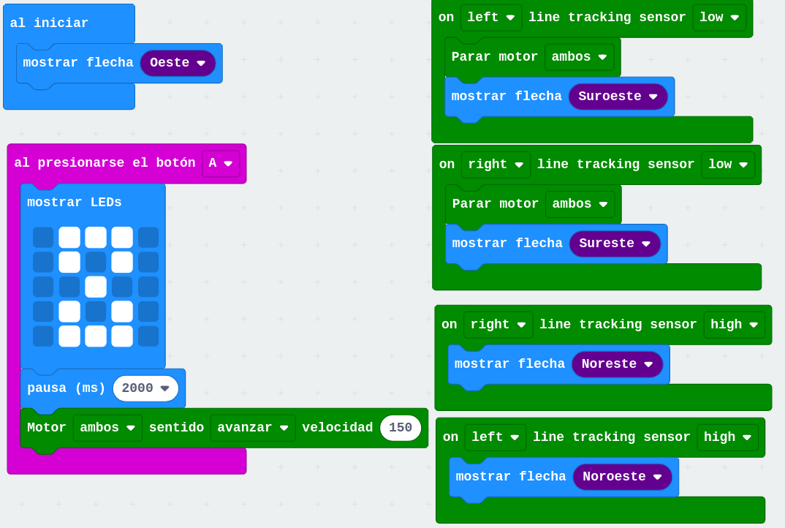

[Programa de calibración](https://makecode.microbit.org/_JM7FAa9eaKY3)

Pondremos maqueen con el tapete que usaremos y suficiente espacio para que quede espacio de sobra para parar.

Movemos maqueen para ver el resultado de la lectura de los sensores en cada parte.

Cuando veamos que se leen adecuadamente, pondremos los bloques "Detenemos ambos motores" antes de los bloques "mostrar imagen". **Los bloques que muestran imágenes o texto son bastante lentos y pueden hacer que la reacción del robot sea demasiado lenta**.

Ahora ya podemos programar la reacción de nuestro robot, eliminando todos los bloques para hacer la reacción lo más rápida posible.

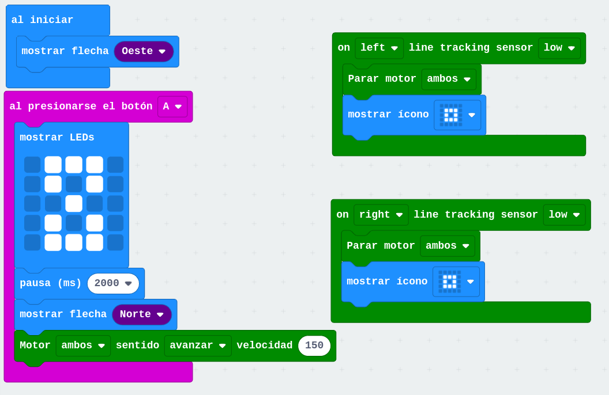

[Programa Stop-linea](https://makecode.microbit.org/_0TD2x8YruPYa)

Ahora vamos a hacer una maniobra sencilla para alejarnos de la línea

[Programa Linea - maniobra](https://makecode.microbit.org/_DTk8W7bsh14u)

#### No te caigas

Vamos a utilizar los sensores de infrarrojos que tiene maqueen en la parte de abajo para evitar que se caiga de la mesa. Desgraciadamente el diseñador los ha puesto detrás de la rueda loca con lo que salvo que nos movamos muy, muy despacio la rueda va a sobresalir de la mesa con el considerable peligro

[Proyecto](https://makecode.microbit.org/_iTR64w0P1Jtc)
 
#### Receptor de infrarrojos

Lee los datos y se quedan con los últimos dígitos

Con este [sencillo programa](https://makecode.microbit.org/_Dm7961WkhHP6) podemos ver los códigos de las distintas teclas de los mandos

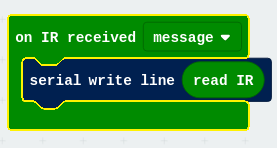

        screen /dev/ttyACM0 115200

### Mando a distancia

Vamos a usar las comunicaciones por radio para comunicar 2 microbit: una que actuará como mando y la otra que controlará a maqueen

Estableceremos unos códigos numéricos para cada orden y la pulsación de los botones del mando y algunos gestos enviarán esos códigos

|Botón/Gesto| Acción|Código
| --- | --- | ---
|A+B inclinado hacia arriba|Adelante| 1
|A+B inclinado hacia abajo|Atrás|4
|A|giro a la izquierda|3
|B|Giro a la derecha|2    
|Pantalla cara al suelo|Parar|0
| Agitado | Luces On |5

Para hacer visible la orden que vamos a enviar se mostrarán unos iconos/flechas en la pantalla del mando

Usaremos un grupo de radio distinto para cada par mando/maqueen

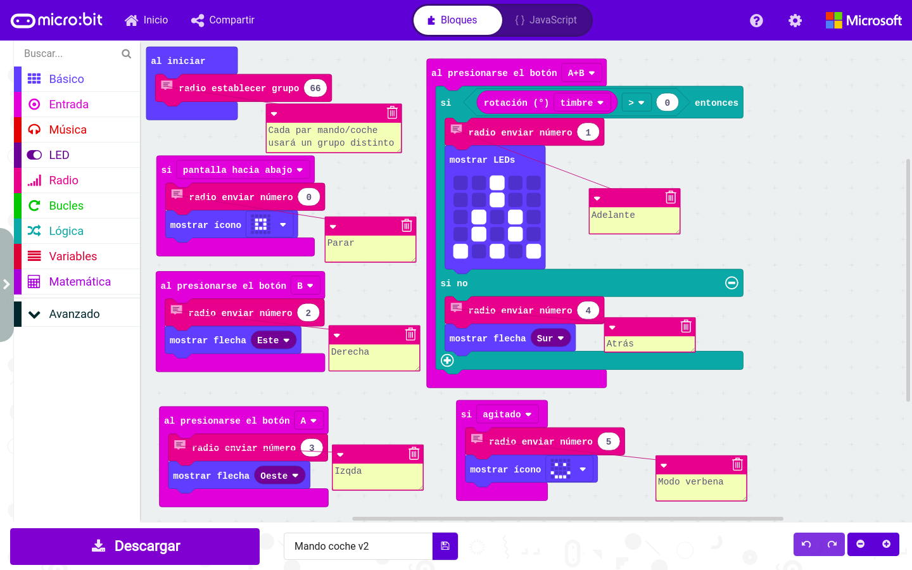

En la micro:bit de maqueen establecemos el mismo grupo de radio y  en función del código recibido realizaremos las acciones correspondientes.

Para hacerlo más claro se han definido funciones, una para cada acción. En ellas se hacen los movimientos correspondientes, se encienden/apagan leds y se muestran los mismos iconos en la pantalla

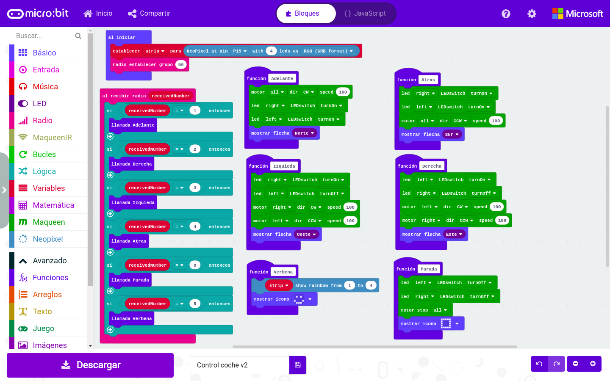

Para probarlo programamos las 2 micro:bit cada una con su programa y vemos que efectivamente cuando se manda una orden la otra muestra el mismo icono.

Una vez verificado el funcionamiento montamos la micro:bit correspondiente en maqueen y a probar los movmientos

[Programa del mando v2](https://makecode.microbit.org/_MsWR74gMag54)

[Programa de control coche v2](https://makecode.microbit.org/_hrzTPR2TX380)

## Midiendo distancias con el sensor de ultrasonidos

(La extensión de maqueen en una Raspberry no da la medida del sensor de ultrasonidos en cm, sino en milisegundos. Se puede ver en la imagen que no aparece el selector en "cm". Podemos convertir el tiempo en en milisegundos a cm dividiendo por 29 (debería ser dividendo por 2*29):
340m/s > 29ms/cm, pero deberíamos contar la ida y la vuelta... [referencia](https://stackoverflow.com/questions/41501360/getting-distance-in-inches-and-cm-from-ultrasonic-sensor-in-arduino)
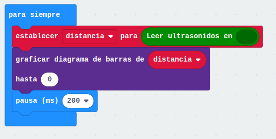

Vamos a medir la distancia hasta un objeto con el sensor de ultrasonidos.

Empezaremos mostrando el valor de la medida en una gráfica que podremos ver con más detalle en la consola de makecode

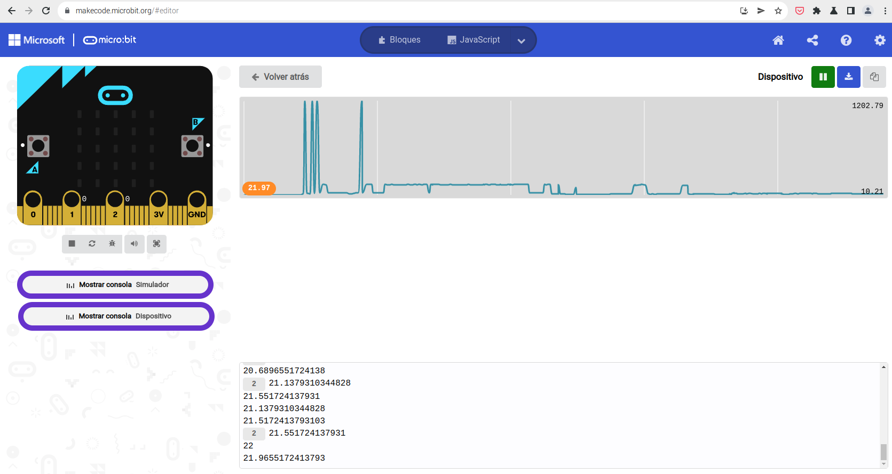

A veces se producen errores en la lectura del sensor (o en la reflexión del pulso de ultrasonidos), por lo que podemos añadir un sencillo filtro para que los valores por encima de 500 no se muestren

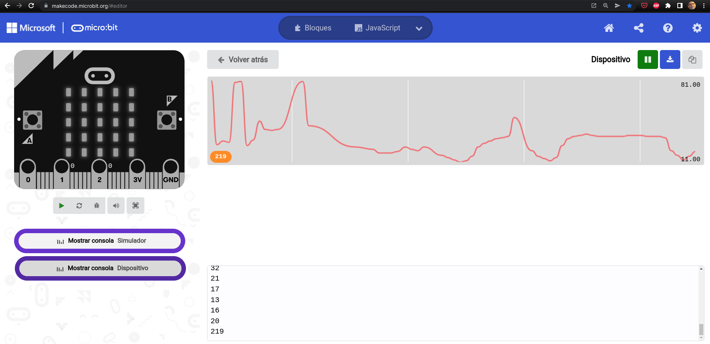

[maqueen - gráfico de medida del sensor de ultrasonidos ](https://makecode.microbit.org/_h512hDfmLe0Y)

Ahora vamos a hacer que en función de la distancia se enciendan los leds de maqueen:

* Por debajo de 5cm encendemos los 2
* Entre 5 y 10cm enedemos sólo el izquierdo
* Por encima de 10cm apagamos los dos

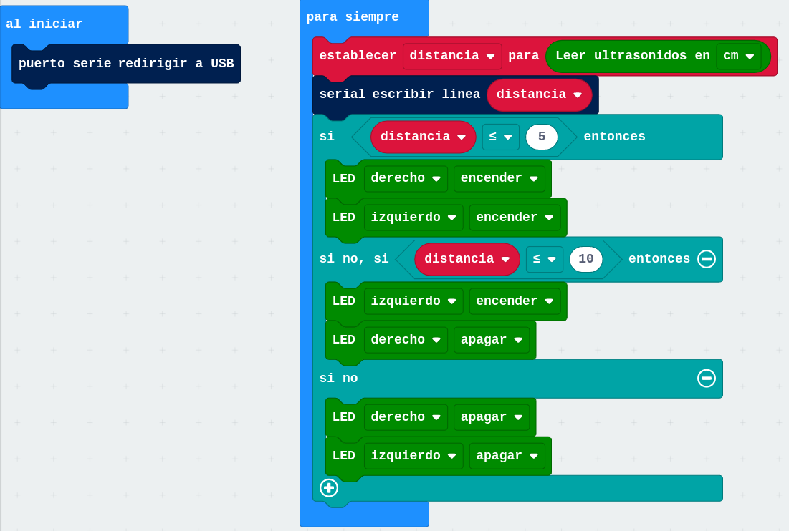

Y la versión filtrada (valores menores de 500cm)

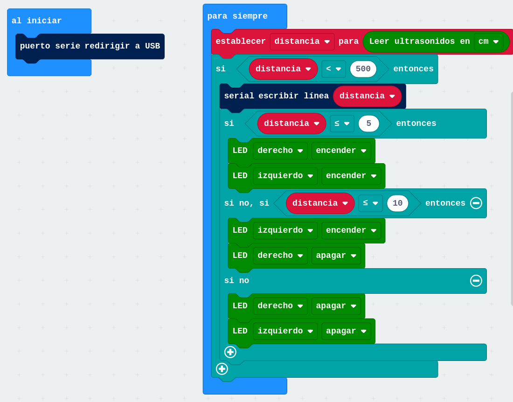

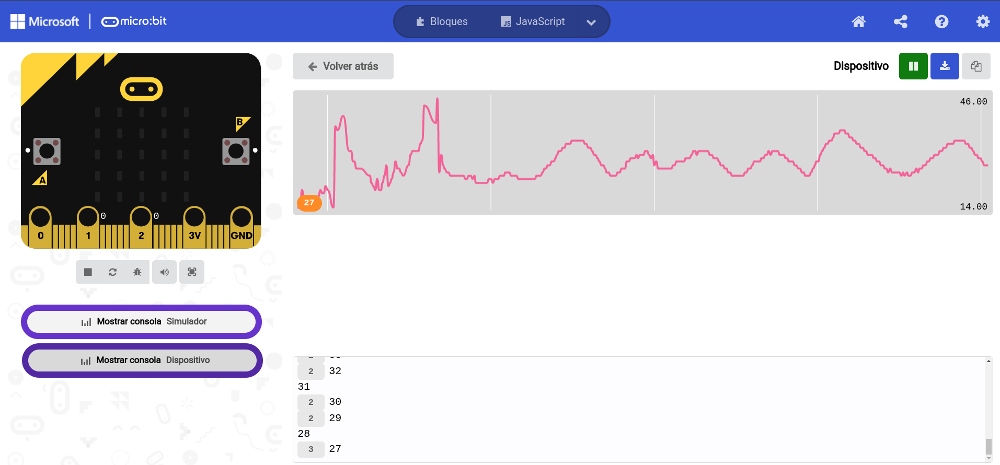

[maqueen - ultrasonidos - leds](https://makecode.microbit.org/_7a5V668dzceM)

## Otros retos

### Sígueme

Medimos la distancia con el sensor de ultrasonidos y nos movemos en función de que la distancia se haga mayor o menor que una determinada.

### Siguelíneas

Usamos los sensores infrarrojos de maqueen seguimos una línea negra. Para ello cambiamos de dirección si uno de los sensores detecta blanco.

#### Motores
 
[Movimientos random](https://makecode.microbit.org/_EkmXK2DV3Edq)

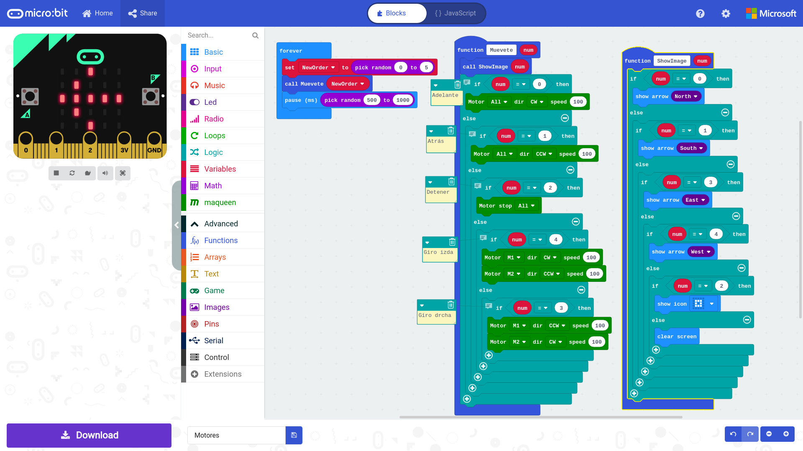
 
[Movimientos básicos](https://makecode.microbit.org/_8mva3TEVH0rM)

[Sonidos y leds delanteros](https://makecode.microbit.org/_XrVhsU9tuH5x)

[Me muevo cuando hay luz](https://makecode.microbit.org/#editor)

[Ciclos de color RGB](https://makecode.microbit.org/_6hh2pqT959hh)

[Muestra la distancia](https://makecode.microbit.org/_AKAVHXVqkJM3)

[Huyo de los obstaculos](https://makecode.microbit.org/_C888wYRmrFAf)

[Siguelineas](https://makecode.microbit.org/_ApcYWLC3z7ok)

### Programando con Arduino

[Programación de Maqueen con Arduino](https://www.instructables.com/id/Using-the-DF-Robot-Micro-Maqueen-MicroBit-Robot-Pl/)

### Recursos 

[Wiki del producto](https://wiki.dfrobot.com/micro:Maqueen_for_micro:bit_SKU:ROB0148-E%28ROB0148%29)

[Página del producto](https://www.dfrobot.com/product-1783.html?search=maqueen)

[Ideas para retos](https://raw.githubusercontent.com/Frances9/ROB0148/master/Crazy%20Maqueen%20Tutorial-English.pdf)

[Otros ejemplos de movimiento](https://www.rapidonline.com/bitbot)

[PodCast de Juegos Robótica sobre maqueen](https://juegosrobotica.es/podcast-036/)
