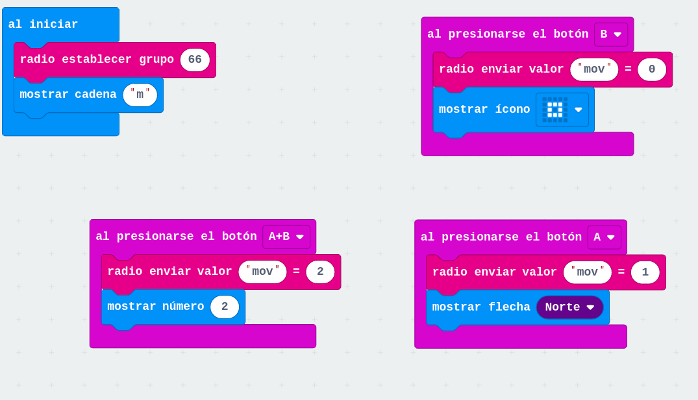
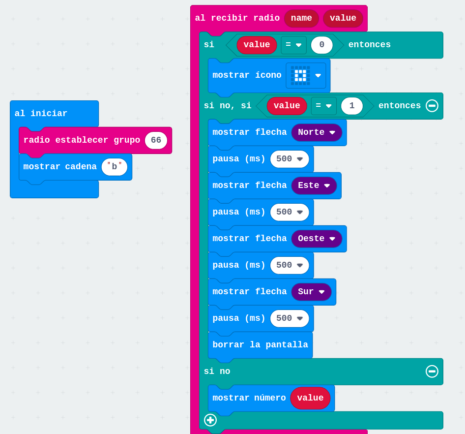
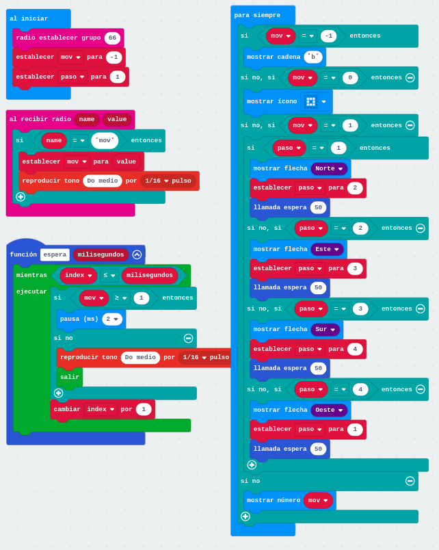

# Coreografías

Vamos a utilizar la radio para controlar una coreografía con varias micro:bit, en el ejemplo nos vamos a limitar a mostrar diferentes imágenes en la pantalla, pero podemos adaptarlo fácilmente para que varios maqueen hagan movimiento sincronizados.

Tendremos un _maestro_ que se encargará de enviar las órdenes, según pulsemos el botón A o el B o ambos

[Mando](https://makecode.microbit.org/_Fj3VfRR6CJ12)

Y varios robots/micro:bit _bailarines_ que al recibir los comandos harán su coreografía

[Bailarín coreografía](https://makecode.microbit.org/_5t2RgtC7EXao)

* Imagen inicial (una letra) para identificar qué programa tiene cada micro:bit
* Estamos usando el evento de recibir mensajes para hacer la coreografía
* Demasiado tiempo de espera que impide la recepción de paquetes que hace que algunas órdenes se pierdan

## Optimizado

Vamos a hacer ahora una versión más optimizada en la que:

* Usaremos una variable _mov_ para indicar si estamos haciendo la coreografía o no. Cuando recibamos los mensajes cambiaremos su valor
* Para evitar esperas creamos otra variable _paso_ que nos dice en qué punto de la coreografía estamos. Tras recibir la orden de empezar la coreografía iremos pasando de un paso a otro cada cierto tiempo.
* En lugar de utilizar el bloque _pausa_ creamos una un función _espera_ que además de esperar vigila si ya se ha detenido la coreografía según el valor de la variable _mov_

[Bailarín optimizado interrumpible](https://makecode.microbit.org/_M46h5uCktCtV)

Con este programa podemos interrumpir instantáneamente la coreografía.
