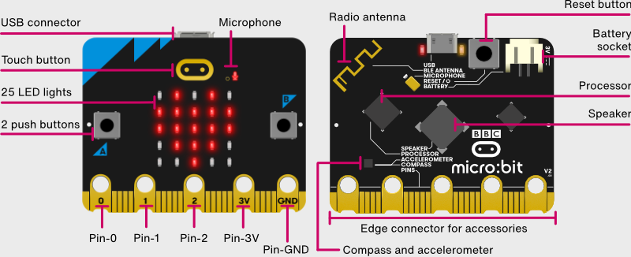
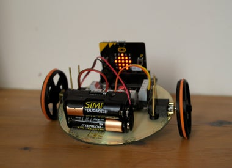
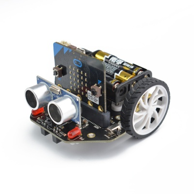

# BBC micro:bit

[Fundación microbit](http://microbit.org/es/)

[Microbit es totalmente Open Source](https://www.microbit.co.uk/open_source)

[Github de microbit](https://github.com/bbcmicrobit)

### [Hardware](http://microbit.org/es/hardware/)

#### Alimentación

Funciona a 3V y dispone de un conector de batería y de alimentación por USB (MicroUSB)

#### Micro

ARM M0 (32 bits) a 16MHz con 16k de RAM

#### [Sensores](https://microbit.org/guide/features/)

* Acelerómetro
* Brújula
* 2 Botones
* 3 entradas analógicas (0,1,2)
* 20 pines I/O

#### Comunicaciones

[Bluetooth](http://microbit.org/es/mobile/) de bajo consumo

Comunicaciones vía radio entre distintas microbits

[App microbit](https://play.google.com/store/apps/details?id=com.samsung.microbit&hl=es) Nos permite interaccionar con la placa e incluso programarla

#### Leds

25 (5x5) leds programables individualmente

### Programación

[Revisión sobre las diferentes plataformas](https://hackaday.com/2017/12/02/exploring-the-bbc-microbit-software-stack/)

[Programando con bloques](https://pxt.microbit.org/?lang=es)

[Programando en python](http://python.microbit.org/)

[Python en micro:bit](https://www.python.org/community/microbit/)

[Programando con el IDE de Arduino](https://learn.adafruit.com/use-micro-bit-with-arduino?view=all)

[Flappy bird en python](https://www.elecfreaks.com/12454.html)

### Dónde comprarlo

[Revendedores](http://microbit.org/es/resellers/)

[También en Amazon](https://www.amazon.es/BBC-MB80-Micro-Bit/dp/B01G8WUGWU/ref=sr_1_2?ie=UTF8&qid=1492513787&sr=8-2&keywords=microbit)

Complementos/shields

[Placa adaptadora 3.3v/5v y de fácil conexión de sensores](https://www.elecfreaks.com/12396.html)

### Robots

http://www.instructables.com/id/Remote-Controlled-Microbit-Robot/

### Documentación

[Getting started](http://microbit.org/es/start/)

[Placa conexión con octupus](https://www.elecfreaks.com/12396.html)

[Usando la Brújula](https://www.elecfreaks.com/12412.html)

[Arcade in javascript](https://www.elecfreaks.com/12416.html)

### Recursos

[Nice review](https://www.youtube.com/watch?v=7qnSsc54bEQ)

* Usar  url sencillas y que estén visibles
* CPU https://en.wikipedia.org/wiki/Micro_Bit#Hardware

        Nordic nRF51822 – 16 MHz 32-bit ARM Cortex-M0 microcontroller, 256 KB flash memory, 16 KB static ram
 
[Alimentación](https://support.microbit.org/support/solutions/articles/19000013982-how-do-i-power-my-micro-bit-)

* Sensor de temperatura está en la CPU (https://microbit.org/es/guide/temperature/)

